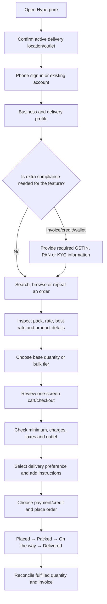

# Zomato Hyperpure: Procurement Experience & Operational Risk Audit

**Prepared by:** Theepan SS  
**Purpose:** Internship selection research assignment  
**Audit date:** 12 July 2026  
**Suggested submission filename:** `Zomato_Hyperpure_Audit_Report.md`  
**Research lens:** A restaurant purchase manager trying to replenish stock quickly without causing cost, quantity, tax, or delivery mistakes

---

## 1. Audit Position

This report evaluates Hyperpure not simply as an ecommerce application, but as an **operational control system for a commercial kitchen**.

A consumer can tolerate browsing, experimentation, and a late replacement. A restaurant buyer works under different pressure:

- ingredients may be required before the next service,
- one pack may contain many sellable units,
- small unit-rate differences become significant at scale,
- delivery must match receiving hours,
- and every fulfilled quantity must reconcile with an invoice.

Therefore, the central UX question used throughout this audit is:

> **Does the interface help a business buyer make a fast decision without losing control of quantity, cost, compliance, or delivery?**

The public audit found that Hyperpure is strongest when it translates wholesale complexity into understandable actions. Its catalogue shows sellable packs, normalized prices, ratings, a “Best rate,” and quick-add controls. Its recent official app updates also emphasize one-screen checkout, multi-outlet management, voice delivery instructions, and centralized discounts.[1][2][3]

The areas that could not be fully validated without a merchant account are document approval states, current minimum-order warnings, stock exceptions, itemized checkout taxes, and the invoice PDF download route. These are labelled as **not publicly verified** rather than assumed.

---

## 2. Buyer Persona and Jobs to Be Done

### Primary persona

**Name:** Arun, Purchase Manager  
**Business:** Three-outlet casual dining restaurant  
**Buying frequency:** Daily fresh items; weekly dry goods and packaging  
**Environment:** Mobile phone, noisy kitchen, limited time  
**Main risks:** wrong outlet, wrong pack size, insufficient quantity, missed discount, delayed delivery, tax mismatch

### Core jobs

| Job | What Arun needs from the interface |
|---|---|
| Replenish quickly | Find regular products with minimum navigation |
| Compare commercial value | See case price and normalized unit price together |
| Avoid quantity errors | Understand pieces, packs, kilograms and tier thresholds |
| Control cash outflow | Know subtotal, tax, charges and savings before ordering |
| Protect kitchen operations | Select a valid receiving slot and track arrival |
| Maintain compliance | Keep business/tax details accurate and obtain invoices |
| Manage multiple branches | Always know which outlet is active |

This persona creates a distinct evaluation perspective: **speed matters, but error prevention matters more**.

---

## 3. Evidence and Confidence Method

The audit uses four evidence labels:

- **Observed:** visible on a current official Hyperpure page.
- **Officially announced:** described in an official App Store/Play Store listing or release note.
- **Inferred:** a reasonable interpretation of official evidence.
- **Not verified:** requires authenticated access or a completed transaction.

### Sources inspected

- Hyperpure public homepage and category/product pages
- Hyperpure Terms & Conditions
- Official Apple App Store listing and version history
- Official Google Play listing
- Official Hyperpure content about signup and platform access

No private merchant credentials, compliance documents, or payment method were used.

---

## 4. Operational Journey Map

### 4.1 Main procurement journey



### 4.2 Error-prevention checkpoints

```text
Outlet check
    ↓
Pack-size check
    ↓
Tier and line-total check
    ↓
Minimum-order and tax check
    ↓
Delivery-slot check
    ↓
Fulfilment and invoice reconciliation
```

These checkpoints are the places where a B2B interface should stop expensive mistakes before they reach the kitchen.

---

# 5. Onboarding and Business Verification

## 5.1 Entry and account setup

The public web interface starts with **location**, catalogue access, search, and login/signup.[1] This ordering is logical because procurement availability is location-dependent.

Hyperpure’s official content states that a user can sign in and start ordering using a phone number.[4] Its Terms require the merchant to keep business and operational information accurate, including name, address, telephone number, email, manager/contact-person details, delivery address, and delivery times.[5]

The App Store version history also announces support for adding and managing multiple outlets under one account.[3]

### Operational interpretation

The likely account structure is:

```text
Phone identity
  → business identity
  → one or more outlets
  → contact/receiver
  → delivery address
  → receiving hours/instructions
  → financial and tax profile
```

The exact fields for owner name, shop coordinates, business type, or map-pin confirmation were not publicly visible.

## 5.2 GSTIN, PAN, FSSAI and KYC

### Confirmed

The Terms state that GSTIN, PAN and other requested documents are used for appropriate invoices and settlement. PAN/GST information may also be used to evaluate credit eligibility, while wallet access can involve KYC requirements.[5]

### Important accuracy note

A universal FSSAI upload step was **not established** in the reviewed public Terms or signup guidance. The Hyperpure website itself displays the company’s FSSAI licence in the footer, but that does not prove that every buyer must upload an FSSAI licence.[2]

The report therefore does not say that GSTIN or FSSAI must always be completed before catalogue access.

## 5.3 Pending versus verified state

The actual pending/approved UI could not be inspected publicly.

From an operations perspective, one global “Verification pending” message would be insufficient. The interface should separate the status and effect of each profile:

```text
Business profile        Verified
Delivery outlet         Active
Tax profile             Under review
Wallet KYC              Not started
Credit facility         Not applied
Ordering                Available
```

### Recommended status card

```text
┌──────────────────────────────────────────────────────┐
│ TAX PROFILE — UNDER REVIEW                           │
│ GSTIN submitted: 11 Jul 2026                         │
│                                                      │
│ You can continue placing prepaid orders.             │
│ Tax invoicing or credit features may be restricted.  │
│                                                      │
│ [Review details] [Replace document] [Get support]    │
└──────────────────────────────────────────────────────┘
```

### Audit judgement

**Strength:** low-friction phone entry is suitable for acquisition.  
**Risk:** public information does not explain how restrictions are communicated after signup.  
**Priority:** make verification feature-specific and recoverable.

---

# 6. Catalogue Navigation and Search

## 6.1 Catalogue as a kitchen-supply map

The public catalogue includes food ingredients and non-food operational items such as packaging, cleaning consumables, kitchenware, and appliances.[1][2] This is valuable because it reflects how a restaurant actually purchases rather than forcing the buyer into separate systems.

Visible top-level groups include:

- Fruits & Vegetables
- Dairy
- Masala, Salt & Sugar
- Chicken & Eggs
- Packaging Material
- Frozen & Instant Food
- Cleaning & Consumables
- Flours, Pulses and Rice
- Meat and Seafood
- Kitchenware and Kitchen Appliances

### Hierarchy depth

The public site demonstrates at least:

```text
Department
  → operational subcategory
      → product
```

For example:

```text
Packaging Material
  → Cake Delivery Solutions
      → Premium Cake Box, Pack of 50
```

The page also uses breadcrumbs, subcategory choices, product cards and filters.[2]

## 6.2 Search

The global search field accepts “items or categories.”[1] The App Store version history states that the Product Search and Product Details pages were redesigned to improve clarity and navigation.[3]

The public catalogue’s structured names include brand, weight, pieces, pack count, frozen/fresh state and product type. This gives search a strong data foundation.

### Search scenarios a procurement buyer needs

| Input | Required interpretation |
|---|---|
| `Amul butter 500 g` | brand + item + exact size |
| `onion 25 kg` | aggregate need converted into valid packs |
| `cake box 50` | product + pack count |
| `buter` | spelling correction |
| `same milk as last week` | order-history personalization |
| pasted kitchen list | multi-product extraction |
| `available tomorrow morning` | fulfilment-aware results |

Advanced typo correction, unit conversion and slot-aware search were not conclusively testable.

## 6.3 Filters

Public category pages visibly use filters such as ratings and type, and category structure itself narrows the list.[2]

A stronger operational filter model would prioritize:

1. deliverable to the active outlet,
2. available in the required slot,
3. pack size,
4. unit-rate range,
5. brand,
6. dietary/storage class,
7. previously ordered,
8. bulk discount available.

### Audit judgement

**Strength:** the taxonomy is aligned to kitchen work.  
**Risk:** a broad catalogue can create scanning overload.  
**Opportunity:** personalize category order and filters using outlet purchase history.

---

# 7. Product Cards and Bulk-Price Decisions

## 7.1 What the card communicates

Current official category pages show combinations of:

- product name,
- pack configuration,
- rating,
- total price,
- price per piece or pack,
- lower “Best rate,”
- and an ADD action.[2]

For example, packaging cards can show “Pack of 50,” a total pack price, a calculated per-piece rate, and a lower best per-piece rate. Other products show piece ranges, frozen state, individual weight and total pack weight.[2]

### Component anatomy

```text
┌───────────────────────────────────────────────────┐
│ Image                         Veg/Non-veg marker  │
│ Product name, brand and state                    │
│ 50 pieces / 1 case                               │
│ Rating                                           │
│                                                  │
│ ₹586.95 total                                    │
│ ₹11.74 per piece                                 │
│ ₹11.05 Best rate                                 │
│                                      [ADD +]     │
└───────────────────────────────────────────────────┘
```

## 7.2 Why dual pricing is important

A business buyer needs two answers:

- **Can I afford this pack now?** → total pack price
- **Is this commercially better than another pack?** → normalized unit price

Showing both prevents the common error of selecting a cheaper-looking case that is actually more expensive per usable unit.

## 7.3 Volume tiers

Public product pages and cards expose lower rates at larger quantities and may translate the threshold into an **Add N** action.[2]

The ideal mental model is:

```text
Base case        1 case        standard rate
Value tier       4 cases       lower rate
Best tier        12 cases      best rate
```

### Operational strength

The buyer does not need to divide a kilogram or piece threshold by the pack size.

### Missing clarity

“Best rate” should always state the qualifying quantity beside it. Without that, the buyer may incorrectly expect the best rate for one pack.

### Recommended tier component

```text
Current cart: 3 cases / 150 pieces

4+ cases     ₹10.90/piece
Add 1 case to unlock
Estimated line saving: ₹42

12+ cases    ₹10.40/piece
Best for monthly stock
```

## 7.4 Price recalculation

A quantity change should update these values as one unit:

```text
number of packs
aggregate kilograms/pieces
applicable tier
rate per unit
line total
line saving
cart subtotal
minimum-order progress
tax estimate
```

The authenticated transition could not be observed, so this is an evaluation requirement rather than a claim about the current animation.

## 7.5 MOQ and stock

MOQ, available stock and discount threshold are separate business rules:

| Concept | Meaning |
|---|---|
| MOQ | smallest quantity the buyer is allowed to order |
| Stock | quantity that can currently be fulfilled |
| Tier | quantity that unlocks a cheaper rate |

The current public audit did not confirm a dedicated MOQ label, low-stock warning, restock date or out-of-stock substitution flow.

### Audit judgement

**Strength:** strong economic information density.  
**Risk:** “Best rate” can be misunderstood without its threshold.  
**Priority:** expose total saving and next-tier progress, not just the cheaper rate.

---

# 8. Cart, Checkout and Delivery

## 8.1 One-screen checkout

Hyperpure’s official iOS version history states that the cart was redesigned so a buyer can review items and finalize an order on one seamless screen.[3]

This is a useful direction because it keeps the relationship between quantity, discount, delivery and payment visible.

### Recommended information order

```text
1. Active outlet
2. Delivery group and slot
3. Products and quantities
4. Volume discounts
5. Minimum-order progress
6. Tax and charges
7. Payment/credit
8. Final confirmation
```

The outlet must remain at the top. A perfectly priced order sent to the wrong branch is still an operational failure.


### Field Evidence B — Payment flexibility

<p align="center">
  
</p>

<p align="center"><em>Official promotional screenshot showing several payment routes for business orders.</em></p>

The range of payment routes reduces checkout abandonment across small vendors and larger food businesses. The risk-control requirement is to make the selected method, credit impact, refund destination and invoice status unambiguous before confirmation.

**Source:** Hyperpure official Google Play listing, accessed 12 July 2026.[6]

## 8.2 Minimum Order Value

The present MOV amount and warning style were not publicly observable. It may also vary by city, account or delivery model.

A useful warning should answer three questions:

```text
What is the minimum?
How much more is required?
Which products can efficiently close the gap?
```

Example:

```text
₹1,720 / ₹2,000 delivery minimum
Add ₹280 more

Suggested from your regular purchases:
[Milk] [Onion] [Takeaway containers]
```

Recommendations should be based on likely replenishment, not unrelated impulse products.

## 8.3 Tax and invoice estimator

The Terms confirm that goods are delivered with an invoice, that the price and applicable taxes are reflected in it, and that TCS can apply under specified legal conditions.[5]

The current public checkout did not expose a verifiable detailed tax summary.

### B2B-standard summary

```text
Merchandise value
Bulk discounts
Coupon discount
Delivery/service charge
Taxable value
GST grouped by rate
TCS, if applicable
Wallet or credit adjustment
Final payable
```

The buyer should be able to open an item-level tax view without leaving checkout.

## 8.4 Delivery operations

Official materials emphasize flexible delivery models, including next-day, same-day and specialty delivery.[1] The App Store version history also announces voice-recorded delivery instructions and multi-outlet management.[3]

Voice instructions are particularly useful when the receiving point is difficult to describe in a short text field.


### Field Evidence A — Delivery promise as an operational contract

<p align="center">
  
</p>

<p align="center"><em>Official promotional screenshot used to examine cutoff and receiving-time expectations.</em></p>

From an operations perspective, this is not only marketing copy. The cutoff and preferred-slot promise influence kitchen planning, staffing and buffer stock. The live system should therefore show whether the selected outlet and every item in the basket remain eligible for the displayed promise.

**Source:** Hyperpure official Google Play listing, accessed 12 July 2026.[6]

### Delivery component

```text
Outlet: T. Nagar Kitchen
Receiving hours: 06:00–10:30

Delivery: Monday, 13 July
[06:00–08:00] [08:00–10:00]

Instructions
[Type note] [Record voice]
```

### Risk controls

- warn when slot falls outside receiving hours,
- show the order cutoff,
- show split deliveries before payment,
- distinguish chilled/frozen/ambient fulfilment,
- preserve outlet-specific instructions,
- notify the buyer if the promised slot changes.

### Audit judgement

**Strength:** current product direction recognizes real delivery operations.  
**Risk:** the value of slot selection depends on delivery reliability.  
**Priority:** make delay, short-supply and revised ETA states explicit.

---

# 9. Tracking and Post-Purchase Control

## 9.1 Status board

Official app-store materials depict a simple order journey:

```text
Order placed → Packed → On the way → Delivered
```

This is easy to scan and suitable as the first layer.


### Field Evidence C — Glanceable logistics timeline

<p align="center">
  
</p>

<p align="center"><em>Official promotional screenshot of the four-stage tracking timeline.</em></p>

The four stages are easy to understand during a busy service-preparation period. For procurement control, the timeline should be paired with confirmed quantity, short supply, revised payable amount and proof of delivery.

**Source:** Hyperpure official Google Play listing, accessed 12 July 2026.[6]

### Procurement-grade expansion

A business buyer also needs:

```text
Ordered quantity
Confirmed quantity
Packed quantity
Short-supplied quantity
Substituted quantity
Final charged quantity
```

### Suggested tracking card

```text
ORDER HP-20891                  OUT FOR DELIVERY

Placed                 10:42 PM
Packed                  04:55 AM
On the way              06:15 AM
ETA                     07:10–07:35 AM

2 items short supplied
Estimated amount revised
[Review changes] [Track vehicle] [Contact support]
```

## 9.2 Invoice and documents

Hyperpure’s Terms confirm delivery of the relevant invoice and GST particulars.[5] The exact PDF-download location could not be publicly verified.

The post-purchase information architecture should be:

```text
Orders
  → Delivery
  → Fulfilled items
  → Adjustments
  → Payments
  → Documents
       Tax invoice
       Credit note
       TCS certificate
       Proof of delivery
```

For a multi-outlet business, monthly export by GSTIN, outlet and date range would be a valuable accounting feature.

### Audit judgement

**Strength:** simple status progression.  
**Risk:** a status label alone does not explain quantity or financial changes.  
**Priority:** combine logistics status with fulfilment and invoice reconciliation.

---

# 10. Task-Based UX Scorecard

Scores reflect publicly observable evidence, not a private-account usability test.

| Buyer task | Score / 5 | Reason |
|---|---:|---|
| Understand what the platform supplies | 4.5 | Broad, restaurant-oriented categories |
| Locate a product | 4.0 | Search plus category/subcategory structure |
| Compare packs commercially | 4.5 | Total price and normalized price |
| Understand bulk savings | 4.0 | Best rate and tier actions; exact savings can be clearer |
| Prevent outlet mistakes | 4.0 | Multi-outlet support announced; active-outlet safeguards not tested |
| Complete checkout efficiently | 4.0 | One-screen checkout officially announced |
| Understand tax before payment | 2.5 | Policy is clear; current detailed UI not verifiable |
| Plan receiving | 4.0 | Flexible delivery and voice instructions |
| Handle exceptions | 2.5 | Short supply, substitution and stock states not publicly verified |
| Retrieve accounting records | 3.0 | Formal invoice confirmed; download/export path not verified |

**Overall public-evidence score: 3.7 / 5**

This is not a product-quality rating. It is an audit-confidence score based on what a researcher can verify without completing an authenticated order.

---

# 11. Five High-Value Patterns for a Premium B2B Platform

## 1. A persistent outlet context

The active outlet must remain visible during search, cart, payment, tracking and invoice access.

## 2. Commercially complete product cards

Every card should show sellable pack, total cost, normalized rate, tier threshold and estimated saving.

## 3. A quantity-to-tier guidance system

Instead of only saying “Best rate,” the interface should state:

```text
Add 2 more cases to unlock the next rate
```

## 4. A checkout control tower

The checkout should combine outlet, fulfilment group, MOV, taxes, discounts, delivery slot and payment without hiding consequences across separate screens.

## 5. Post-purchase reconciliation

Tracking should connect operational and financial truth:

```text
ordered → fulfilled → delivered → invoiced
```

This is more valuable to a business than a delivery animation alone.

---

# 12. Priority Recommendations

### P0 — Reduce expensive errors

1. Make the active outlet impossible to miss.
2. Separate MOQ, stock and discount tier.
3. Show the qualifying quantity beside every “Best rate.”
4. Show current MOV progress and exact deficit.
5. Reconcile ordered, fulfilled and invoiced quantities.

### P1 — Improve decision speed

1. Add next-tier savings prompts.
2. Support quantity-aware and typo-tolerant search.
3. Rank regular purchases for the active outlet.
4. Show itemized GST without leaving checkout.
5. Store delivery instructions per outlet.

### P2 — Build operational loyalty

1. Recurring replenishment lists.
2. Buyer/chef/accountant/receiver roles.
3. Purchase approval limits.
4. Monthly invoice and credit-note export.
5. Price-change and stock-risk alerts.

---

# 13. Research Gaps and Suggested Validation

A second-stage test should use an authorized merchant account and record:

| Scenario | Evidence needed |
|---|---|
| New signup | fields, OTP, business type, location capture |
| Tax verification | pending, rejected, correction and approval UI |
| Search | typo, brand, size, units and zero-result behaviour |
| Bulk tier | live rate and total recalculation |
| Stock exception | out-of-stock and substitute flow |
| MOV | amount, scope and warning timing |
| Tax | item-level GST/TCS and invoice reconciliation |
| Delivery | cutoff, receiving hours, split delivery and voice note |
| Tracking | ETA, short supply and support |
| Invoice | PDF location, credit note and bulk export |

---

# 14. Conclusion

Hyperpure’s public experience demonstrates a clear understanding of B2B buying: a product is not only an image and a selling price; it is a **pack, a unit economy, a quantity decision and a delivery commitment**.

Its strongest visible design choices are:

- restaurant-specific catalogue organization,
- combined pack and unit pricing,
- actionable volume tiers,
- multi-outlet direction,
- one-screen checkout,
- and operational delivery instructions.

The most important opportunity is to evolve the platform from an efficient ordering interface into a complete procurement control system. That requires stronger visibility into compliance status, MOQ, stock, minimum order, tax, short supply and invoice reconciliation.

---

# 15. AI Disclosure, Token Estimate and Prompt Review

## 15.1 AI disclosure

This report was prepared with assistance from OpenAI ChatGPT. AI was used for research organization, evidence comparison, report structuring, flow diagrams and language editing. Product-specific claims were checked against official Hyperpure, App Store, Google Play and Terms sources. Features that could not be tested were identified as unverified.

## 15.2 Token estimate

Exact account-level token usage is not visible in the report-generation interface.

Using the **approximation of four characters per token**:

- condensed assignment prompt: approximately **94 tokens**
- completed report: approximately **6,281 tokens**
- completed report length: approximately **3,251 words**

This estimate excludes system instructions, hidden reasoning, web-search responses and tool payloads.

## 15.3 Prompt quality

**Rating: 8/10**

The assignment is strong because it specifies the product, five research areas and expected deliverables. Its main weakness is that it assumes document requirements and interface states before they have been observed.

A stronger version would request:

- a serviceable city,
- app version and platform,
- an authorized merchant account,
- evidence labels,
- screenshots with dates,
- exact test queries,
- and separation between observations and recommendations.

---


## 15.4 Visual evidence log

| Evidence | Operational question examined | Screenshot source |
|---|---|---|
| A | Can the buyer plan around a cutoff and preferred receiving slot? | Official Google Play listing |
| B | Does checkout support different business payment situations? | Official Google Play listing |
| C | Can a kitchen manager understand delivery progress at a glance? | Official Google Play listing |

These images are official promotional material and are used as visual evidence, not as proof that every account currently displays an identical screen.


# 16. Sources

Accessed 12 July 2026.

1. [Hyperpure official website](https://www.hyperpure.com/) — location-aware entry, catalogue, categories and delivery models.
2. [Hyperpure Menu Add-ons category](https://www.hyperpure.com/in/Menu-Addons) and [Cake Delivery Solutions](https://www.hyperpure.com/in/cake-delivery-solutions) — hierarchy, pack information, total price, unit rate and best-rate examples.
3. [Hyperpure on the Apple App Store](https://apps.apple.com/in/app/hyperpure/id1203646221) — search/product-page redesign, Coupons Corner, one-screen checkout, voice delivery instructions and multi-outlet management.
4. [Hyperpure official article: “4 myths about Hyperpure”](https://www.hyperpure.com/blog/4-myths-about-hyperpure-and-what-we-actually-do/) — phone-number entry.
5. [Hyperpure Terms & Conditions](https://www.hyperpure.com/Terms) — merchant information, GSTIN/PAN, invoice, taxes, credit and delivery obligations.
6. [Hyperpure on Google Play](https://play.google.com/store/apps/details?id=com.wotu.app&hl=en_IN) — current platform description, supply-chain positioning and latest update date.

---

**End of report**

